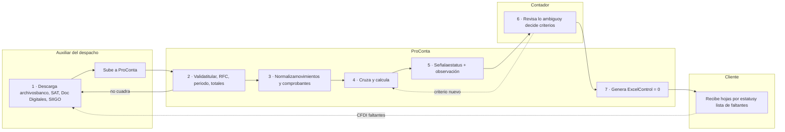
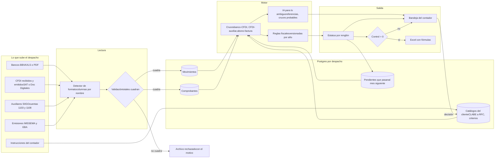
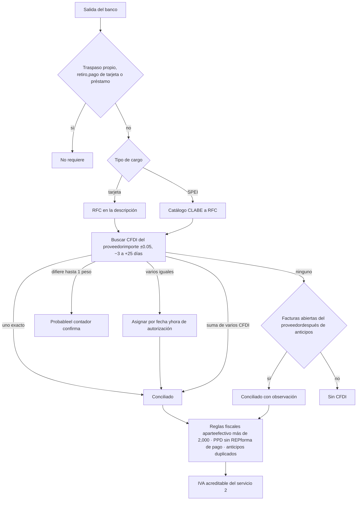
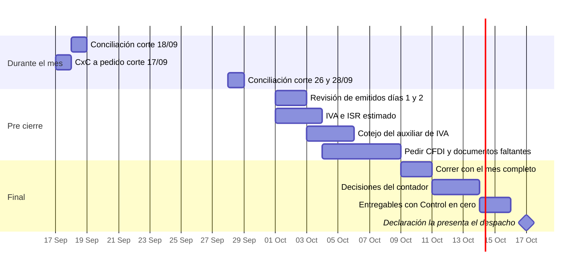
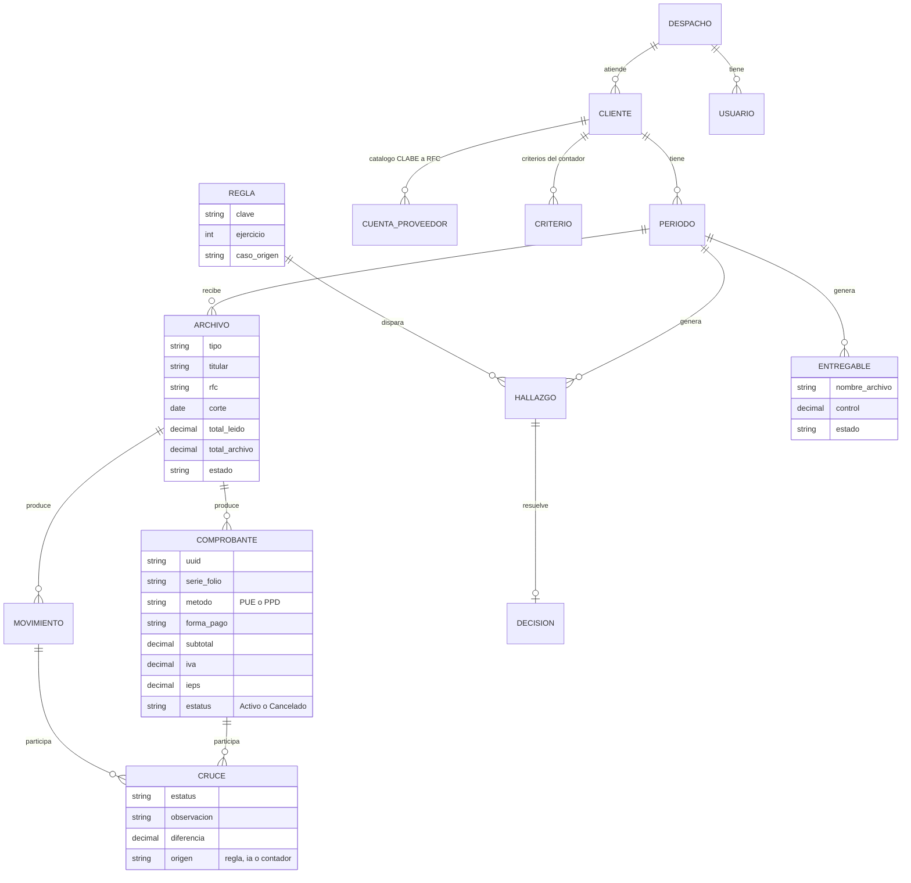

ProConta · Auxiliar contable con IA para despachos · Propuesta de producto

# ProConta: el trabajo de dos auxiliares, revisado por el contador

ProConta lee, cruza, calcula y señala; el contador revisa y decide.

Módulo multiempresa para despachos contables mexicanos. El despacho sube los archivos tal como salen de sus sistemas. ProConta los valida, hace los cruces largos y devuelve un Excel con fórmulas y una hoja de control que debe dar cero. Las cifras del mockup son las de las pruebas con clientes reales; los nombres van en letras.

**No presenta declaraciones**ni firma nada.

**No entra a bancos ni al SAT**El auxiliar descarga los archivos y los sube.

**No decide criterios fiscales**Los señala; el contador resuelve.

**No es un sistema contable**Trabaja sobre los reportes de SIIGO, Doc Digitales y el auxiliar.

Ingeniería de datosArquitecturaFull stackProcesos

Alcance

## Cinco servicios en la app y dos de consultoría

Los cinco primeros se repiten cada mes con reglas claras. En los dos de consultoría la app calcula y una persona decide.

| # | Servicio | Pregunta | Cada cuándo | Archivos que sube el despacho | Probado con | Lo hace la app |
| --- | --- | --- | --- | --- | --- | --- |
| 1 | **Conciliación SALIDAS vs CFDI recibidos** | ¿Cada gasto tiene su factura? | Quincenal / semanal | Movimientos BBVA (XLS/PDF), CFDI recibidos (SAT o Doc Digitales) | A · casos 4.1, 4.4 | 85–90% |
| 2 | **IVA e ISR del mes** | ¿Cuánto voy a pagar de impuestos? | Pre cierre y Final | Lo anterior + CFDI emitidos + estado de la tarjeta | A · casos 4.2, 4.4 | 70–80% |
| 3 | **Revisión del trabajo del contador** | ¿Mi contabilidad está bien hecha? | Mensual | Auxiliar de IVA (cuenta 1108) de SIIGO | A · caso 4.3 | ≥ 90% |
| 4 | **Revisión de facturas emitidas** | ¿Mis facturas cobraron bien el IVA? | Pre cierre y Final | Reporte INGRESOS de Doc Digitales, bases de SIIGO | B y C · caso 4.7 | ≥ 90% |
| 5 | **Cuentas por cobrar** | ¿Quién me debe y desde cuándo? | Mensual o a pedido | Auxiliar de clientes (cuenta 1103) | D · caso 4.8 | ≥ 90% |
| C1 | **Asimilados vs RESICO vs nómina** | ¿Cómo le pago a esta persona? | A pedido | Consulta, prima de riesgo, ISN | D · caso 4.5 | 50–60% |
| C2 | **Plan México · deducción inmediata** | ¿Puedo deducir 86% este año? | A pedido | CFDI de la inversión y datos de la empresa | D · caso 4.6 | 30–40% |

Mockup interactivo

## La aplicación del despacho

Usa el menú o el selector de cliente. cifras de las pruebas Los clientes van por letra, como en el documento de pruebas.

app.proconta.mx/despacho-veracruz/cartera/2026-09

ProConta

Despacho

Cliente

Servicios

Consultoría

Cliente Despacho contable · Veracruz · 1 contador, 1 auxiliar

Periodo: Sep 2026

Declaración: 17 oct

### Cartera de clientes · septiembre

Una fila por cliente y una columna por servicio contratado. El color dice dónde hay trabajo; un clic abre el cliente.

Clientes**4***+1 patrón para IMSS*

Decisiones abiertas**12***2 ya decididas*

Entregables con control = 0**3***1 en borrador*

Documentos faltantes**4***tarjeta, Banamex, nómina, IMSS*

| Cliente | Tipo | 1 Concil. | 2 IVA/ISR | 3 Auxiliar | 4 Emitidas | 5 CxC | Consultoría |
| --- | --- | --- | --- | --- | --- | --- | --- |
| **Cliente A** vidrio y aluminio | PF 612 | 44 sin CFDI | estimado | $21,822.90 | — | — | — |
| **Cliente B** venta al público | — | — | — | — | 3 días | — | — |
| **Cliente C** venta al público, IEPS | — | — | — | — | 2 mixtos | — | — |
| **Cliente D** autotransporte | PM | — | — | — | — | cuadra | 2 abiertas |

### Cliente A · septiembre

### Archivos del mes · Cliente A

Antes de calcular, cada archivo se valida: titular, RFC, periodo, fecha de corte y que los totales leídos cuadren con los del propio archivo. Las columnas se buscan por nombre, no por letra.

| Archivo | Formato detectado | Corte | Renglones | Totales | Estado |
| --- | --- | --- | --- | --- | --- |
| Movimientos BBVA PYME | BBVA XLS · encabezado fila 6 | 26/09 | — | cuadran | correr al cierre |
| Movimientos BBVA personal | BBVA XLS | 28/09 | — | cuadran | correr al cierre |
| Export tarjeta de crédito | BBVA XLS | — | 3 | — | insuficiente |
| CFDI recibidos | Doc Digitales XLSX · 1 renglón por CFDI | 30/09 | — | cuadran | ok |
| CFDI emitidos | Doc Digitales XLSX | 30/09 | — | cuadran | hueco 5726 → 5730 |

### Documentos que faltan, deducidos de los que sí llegaron

!

Estado de cuenta de la tarjeta de créditoHay CFDI de Home Depot por $6,898 con forma de pago 04 y el export de la tarjeta trae solo 3 movimientos.

pedir

!

Cuenta de BanamexLlegó un CFDI de comisiones de Banamex y no hay estado de cuenta de ese banco.

pedir

!

CFDI de nóminaSe pagan IMSS, Infonavit e impuesto sobre nómina del 3%, pero no hay CFDI de nómina.

pedir

!

Cargo del IMSSNo aparece en ninguna de las dos cuentas entregadas.

pedir

Ejemplo de validación real (agosto, PDF de 14 páginas): ProConta leyó 122 cargos por $333,204.28 y 31 abonos por $342,020.40, igual que el estado de cuenta. Si no cuadra, el archivo se rechaza y se dice por qué.

### 1 · Conciliación SALIDAS vs CFDI recibidos

140 salidas de dos cuentas BBVA contra los CFDI recibidos de septiembre. El 85% del importe que requiere CFDI ya lo tiene; al corte del 18/09 era el 49%.

PYME al 26/09 · personal al 28/09

| Estatus | Salidas | Importe | Qué significa |
| --- | --- | --- | --- |
| Conciliado | 52 | $108,050.17 | Un CFDI, o varios que suman el cargo |
| Con observación | 7 | $16,771.99 | Tiene CFDI, pero algo no cuadra: forma de pago, PPD sin REP |
| Parcial | 2 | $16,525.26 | Ej. mensualidad del auto: el CFDI solo ampara intereses e IVA |
| Sin CFDI | 44 | $24,349.96 | No deducible mientras no llegue la factura |
| No requiere | 35 | $148,602.60 | Traspasos propios, retiros, pago de tarjeta, préstamos |
| Total | 140 | $314,299.98 |  |

### Lo que encontró

!

Anticipo que se puede deducir dos vecesProveedor de vidrio 2: CFDI de anticipo por $1,052.53 y factura final por $1,052.54 con forma 03 y sin relación tipo 07.

riesgo alto

!

Marca manual sin respaldoUn retiro de $5,009.08 venía marcado “con factura”, pero ningún CFDI ni combinación de CFDI suma ese importe.

revisar

!

Forma de pago distinta al medio realUn CFDI dice 04 (crédito) y se pagó con débito; otro dice 01 (efectivo) y se pagó con tarjeta. Pedir sustitución.

observación

!

PPD sin complemento de pagoWürth, Telmex y Telcel. Sin REP no es deducible ni acreditable.

observación

i

CFDI de otro periodoComisiones bancarias de agosto llegaron en septiembre.

otro periodo

### Cómo cruza

reglas del caso 4.1, ajustadas en 4.3

RFC en la descripción del cargo con tarjetacatálogo CLABE → RFC para SPEIimporte ±$0.05hasta ±$1 si coinciden proveedor y fecha → “probable”ventana de −3 a +25 díashora de autorización = hora de emisiónun pago, varios CFDIbuscar saldo después de anticipos antes de marcar “sin CFDI”

**El contador decide:**si un gasto es personal o del negocio, los cruces “probables” y qué hacer con los 44 sin CFDI.

### 2 · IVA e ISR de septiembre

Persona física, régimen 612, flujo de efectivo: cuenta lo cobrado y lo pagado en el mes. La tarjeta de crédito cuenta a la fecha de la operación.

Pre cierre · corte 26–28/09

**Final bloqueado:**faltan los movimientos de PYME del 27 al 30/09 y de la cuenta personal del 29 al 30/09, y el estado completo de la tarjeta. Sube los archivos para recalcular.

### IVA

con CFDI emitidos

Cobrado con CFDI emitidocon IVA, incluye PPD cobrados por su REP$193,001.20

Cobrado sin CFDI emitidocon IVA; sigue siendo ingreso$129,710.00

IVA trasladado$44,511.89

− IVA acreditablesolo CFDI pagados en el mes−$17,963.17

IVA a pagar$26,548.72

### ISR

estimado

Base gravable del mes$160,754.25

Tarifa mensual 2026Anexo 8 RMF, versionada por añoaplicada

ISR del mes$43,426.71

El pago provisional legal es acumulado de enero al mes, menos pagos anteriores. Sin esos datos ProConta lo marca como estimado.

### Lo que mueve el número

!

$129,710 cobrados sin factura“Liquidación domo” $49,000, “domo y ventanas” $32,000, terminal punto de venta $23,430. Se deben facturar, incluida la factura global.

decidir

!

$82,000 de “préstamos” sin contrato04/09 y 18/09. No se acumularon; sin contrato el SAT los presume ingreso (art. 59 CFF).

decidir

!

Un REP de $41,104 no corresponde a la factura 5724Liquida una factura de agosto aún no identificada.

pendiente

i

Pendientes de agosto aplicadosVAX FC-251384 $14,115.72, Texin $239.90 y Hercon $109, pagados el 01/09, se deducen en septiembre.

aplicado

!

Efectivo fraccionado (detectado en agosto)47 CFDI en efectivo justo debajo de $2,000, emitidos con minutos de diferencia. Se retiraron $39,000 contra $96,590 facturados en efectivo.

criterio

### 3 · Revisión del auxiliar de IVA · agosto

186 partidas del auxiliar de SIIGO cotejadas una por una contra el cálculo independiente. Cada diferencia se clasifica como corte, criterio, documento faltante o error.

IVA en auxiliar**$47,641.49***cuentas 0001 + 0005*

IVA calculado**$25,818.59***solo pagado en agosto*

Diferencia**$21,822.90***explicada al centavo*

| Partida | Tipo | Auxiliar | Cálculo | Diferencia |
| --- | --- | --- | --- | --- |
| Coinciden | ok | $25,762.69 | $25,762.69 | $0.00 |
| Compras con tarjeta del 27 al 31/08 | corte | $7,197.66 | $0.00 | $7,197.66 |
| Efectivo fraccionado | criterio | $12,632.36 | $0.00 | $12,632.36 |
| Documentos de otro mes | corte | $2,048.78 | $0.00 | $2,048.78 |
| IVA que falta en el auxiliar | faltante | $0.00 | $55.90 | −$55.90 |
| Total |  | $47,641.49 | $25,818.59 | $21,822.90 |

!

Saldo inicial anómaloLa cuenta 1108-0001-0002 (IVA por pagar) arranca en −$36,906.51. Una cuenta “por pagar” no debería tener saldo acreedor.

error

↺

El cotejo también revisa a ProContaEncontró 2 errores propios: 4 liquidaciones del proveedor de vidrio 2 ($996.43 de IVA) y un pago de $8,622.15 contra un CFDI de $8,622.01 que la tolerancia de $0.05 no empató. Ambos ya son reglas.

corregido

**El contador decide:**qué lado tiene razón en las diferencias de criterio. El auxiliar acreditó el efectivo fraccionado; ProConta no.

### 4 · Revisión de facturas emitidas · Cliente B

Método del contador, reproducido al centavo: por día, en el último CFDI, W = (Subtotal − Descuento) × 0.16 − IVA. Solo se suman los CFDI activos.

CFDI**327***324 activos · 3 cancelados*

Subtotal**$372,811.19***IVA $59,299.67*

Diferencia W del mes**$350.12***en 3 días*

Base 16% vs SIIGO**$0.00***cuadra al centavo*

### Días de septiembre

23 cuadran · 3 por confirmar

| Día | Folio | Subtotal sin IVA | En SIIGO | Estatus |
| --- | --- | --- | --- | --- |
| 21/09 | 9779 | $149.99 | no registrado | por confirmar |
| 25/09 | 9856 | $669.00 | base 0% | tasa 0% · bomba |
| 29/09 | 9897 | $1,370.00 | base 0% | tasa 0% · bomba |

i

Cancelados y sus sustitutos9687 → 9767 y 9709 → 9768 (de 0% a 16%); 9689 → 9765.

emparejados

!

Folios que no vinieron en el archivo9679, 9697 y 9825.

confirmar

C

Cliente C · IEPS y CFDI mixtos8 facturas globales con IEPS por $22.22 (el IVA va sobre precio + IEPS). Folios 46109 y 46138 con parte sin IVA: explican los $59.18 restantes. Archivo INGRESOS_09_30.

2 por confirmar

**Regla del despacho:**un CFDI sin IVA se marca “por confirmar”, nunca “error”, hasta conocer el giro. Las bombas de riego agrícola van a tasa 0% (art. 2-A LIVA).

### 5 · Cuentas por cobrar al 17/09/2026 · Cliente D

1,608 facturas y 438 abonos del auxiliar 1103. Cada abono se aplica por prioridad: folio exacto, rango con sus extremos, monto exacto, FIFO exacto o suma, y FIFO parcial marcado.

Por cobrar**$1,008,233.23***87 facturas · 8 clientes*

Más de 90 días**31%***$316,442*

Control vs auxiliar**$0.00***18 de 18 cuentas*

Referencias equivocadas**35***de 438 abonos*

### Antigüedad

al 17/09/2026

≤ 90 d · $691,791> 90 d · $316,442

| Cliente | Saldo | Facturas | Nota |
| --- | --- | --- | --- |
| Comercializadora de azúcar | $495,488.34 | 40 |  |
| Cliente agropecuario 1 | $282,262.40 | 26 | sin cobros desde junio |
| Fertilizantes 1 | $108,981.60 | 9 |  |
| Fertilizantes 2 | $48,647.20 | 5 |  |
| Agroindustrial | $38,673.89 | 1 | + diferencia $0.29 |
| Fertilizantes 3 | $15,327.20 | 1 |  |
| Nutrientes | $9,800.00 | 1 | de 2025 |
| Grupo comercial | $9,052.60 | 3 | + diferencia $0.20 |
| Total | $1,008,233.23 | 87 |  |

**Regla:**la referencia del abono es una pista, no la verdad. Si un cliente no cuadra al centavo con el auxiliar, el archivo no se genera.

### C1 · Asimilados vs RESICO vs nómina

Lavador de tolvas por $5,000 semanales. Tarifa semanal ISR 2026, UMA $117.31; prima de riesgo clase IV e ISN 3% supuestos.

consultoría

| Por semana | Asimilados | RESICO | Nómina con IMSS |
| --- | --- | --- | --- |
| La empresa le deposita | $4,366.82 | $5,204.17 | $4,231.08 |
| ISR retenido | $633.18 | $62.50 | $633.18 |
| Costo real para la empresa | \~$5,150 | $5,000 | \~$6,809 |
| Le queda a la persona | $4,366.82 | \~$4,950 | $4,231.08 + prestaciones |

**Recomendación entregada: nómina.**Lavar las unidades en el patio de la empresa, con horario y pago fijo, es relación laboral (art. 20 LFT). Sin IMSS, un accidente lo paga la empresa. Decisión del cliente pendiente.

### C2 · Plan México · tractocamión Freightliner 2026

Deducción inmediata del 86% en el primer año en lugar de depreciar al 25% anual. Subtotal $2,754,310.35, compra 31/07/2026.

consultoría

Deducción inmediata 2026 (86%)$2,368,706.90

Depreciación normal 202625%, 5 meses$286,907.33

Parte en pagos provisionalespor mes, julio a diciembre$394,784.48

ISR diferido 2026\~$624,540

Otra versión daba \~$710,612. Falta fijar una sola definición de “beneficio”.

✓

Fabricado en MéxicoNIV empieza con 3AK.

!

Pedir CFDI de egreso de los 3 anticiposRelación tipo 07; evita inflar el MOI.

×

Constancia previa del ComitéHasta 51 días hábiles; negativa ficta a los 3 meses.

?

Canal: Economía o Ventanilla ÚnicaPor confirmar con una llamada.

**La persona decide:**elegibilidad, canal, firma y seguimiento. ProConta arma el cálculo, el checklist y el borrador del escrito.

### Decisiones del contador

ProConta detectó o calculó; la decisión es profesional. Cada respuesta queda en bitácora y, si es un criterio, se guarda para el siguiente mes.

| Cliente | Qué detectó | Qué hay que decidir | Estado |
| --- | --- | --- | --- |
| A | 47 CFDI en efectivo fraccionados ($12,632 de IVA) | Deducir, rechazar o revisar contra la lista 69-B | abierto |
| A | $82,000 de “préstamos” | Hay contrato o se acumulan | abierto |
| A | $129,710 cobrados sin CFDI | Emitir CFDI o global antes de declarar | abierto |
| A | Intereses del auto en la mensualidad | Límite del art. 36 LISR y depreciación | abierto |
| A | Viajes, ropa, gimnasio, colegiatura | Personal o del negocio | por validar |
| A | Depósito de $60,000 “BMRCASH” | Si es ingreso | decidido: cobro de cliente |
| B | CFDI 9779 sin IVA | Si es bomba de riego a tasa 0% | abierto |
| B | Excluir cancelados de las sumas | Confirmar criterio | decidido |
| C | 2 CFDI mixtos con parte sin IVA | Si la parte es tasa 0% válida | abierto |
| D | Diferencias de $0.29 y $0.20 | Dejarlas visibles o ajustarlas | abierto |
| D | Partidas de 2025 tomadas del reporte de junio | Si siguen abiertas | abierto |
| D | Plan México: $2,368,706.90 de deducción | Elegibilidad, canal, presentar o no | abierto |
| D | RESICO es lo más barato | Contratar por nómina | con el cliente |
| IMSS | Julio 2025 emitido completo | Prorratear desde el día 3 o no | con el cliente |

### Entregables

Excel con el original intacto, columnas de resultado con fórmulas, una hoja por estatus para el cliente y una hoja de Control que debe dar cero. Si no da cero, no se genera.

| Archivo | Cliente | Servicio | Control | Estado |
| --- | --- | --- | --- | --- |
| CLIENTEB_INGRESOS_09_29.xlsx | B | 4 · Emitidas | $0.00 | listo |
| INGRESOS_09_30.xlsx | C | 4 · Emitidas + IEPS | $0.00 | listo |
| Cta_por_Cobrar_20260917.xlsx | D | 5 · CxC | $0.00 | listo |
| Conciliacion_A_2026_09.xlsx | A | 1 y 2 | — | borrador: correr al cierre |

Un intento previo del caso 4.8 dio saldos de −$142,869.58 y −$68,263.42 por un abono de rango mal aplicado. La hoja de Control lo detectó; desde entonces el archivo no se genera si no cuadra.

Proceso

## Quién hace qué en cada mes

Los siete pasos que se usaron en todas las pruebas, repartidos entre el auxiliar del despacho, ProConta, el contador y el cliente.

Arquitectura

## De los archivos al entregable

No hay conexión al SAT ni a bancos: la entrada son archivos. Por eso la capa más importante es la lectura y validación. Las reglas fiscales son código versionado por año; la IA solo interviene en lo ambiguo y todo lo que propone pasa por el contador.

Servicio 1 en detalle

## Cómo se concilia una salida del banco

Incluye las dos correcciones que salieron del cotejo con el auxiliar: buscar saldos después de anticipos y ampliar la tolerancia cuando coinciden proveedor y fecha.

Calendario

## El mes de un despacho con ProConta

Los cortes parciales adelantan el trabajo; al cierre se vuelve a correr con el mes completo. Lo pendiente de un mes alimenta el siguiente.

Modelo de datos

## Entidades principales

Todo cuelga del despacho y del cliente. Cada archivo subido queda guardado tal cual para poder auditar de dónde sale cada cifra.

Qué está probado

## Lo que la app puede prometer hoy

Probado significa que cuadró contra el propio archivo, contra el trabajo manual o lo confirmó el despacho. Esto define el orden de construcción.

| Capacidad | Estado | Evidencia |
| --- | --- | --- |
| Leer XLS y PDF bancarios y cuadrar contra sus totales | probado | Agosto: 122 cargos y 31 abonos idénticos al banco |
| Cruzar salidas bancarias contra CFDI recibidos | probado | 101 y 140 salidas clasificadas |
| Cotejar un auxiliar renglón por renglón | probado | $21,822.90 explicados al centavo |
| Revisión de emitidos con tasa 0% e IEPS | probado | El despacho confirmó “3 días con detalles” |
| Cuentas por cobrar cuadradas contra el auxiliar | probado | 18 cuentas con diferencia cero |
| Encontrar errores en el trabajo manual | probado | Fila duplicada, 20 centavos, errores de corte |
| Cálculo de IVA del mes | en prueba | Falta validar contra una declaración presentada |
| ISR provisional acumulado | en prueba | Solo aislado del mes |
| Consultoría: esquemas de pago y Plan México | en prueba | Un caso cada uno |
| Lectura de XML de CFDI | idea futura | Resolvería tasa 0%, exento, no objeto, IEPS y conceptos |

### Datos

- Columnas por nombre de encabezado: el layout cambia entre clientes.
- Excluir renglones de totales y respetar saldos iniciales.
- Leer el XML del CFDI es el siguiente salto: hoy el XLS no distingue tasa 0%, exento y no objeto.

### Arquitectura

- Datos separados por despacho y por cliente.
- Reglas versionadas por ejercicio, con el caso que las originó.
- Archivos originales guardados sin cambios para auditar cada cifra.

### Full stack

- Excel generado con fórmulas, no con valores pegados.
- Conteos y listados salen del sistema, nunca escritos a mano.
- Nombre de archivo con fecha según la convención del despacho.

### Procesos

- El cotejo cruzado (ProConta contra humano y al revés) es el mejor control probado.
- Cada error encontrado se convierte en una validación.
- Las preguntas al despacho salen de la bandeja, no de WhatsApp sueltos.