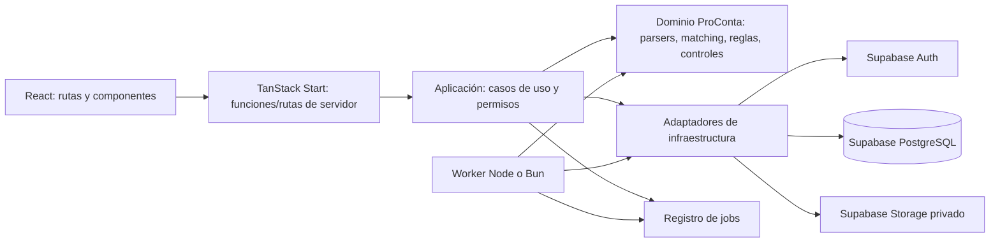
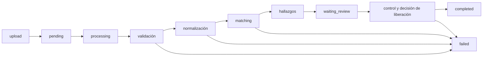

# ProConta — Arquitectura V1

**Estado:** diseño técnico, sin implementación. **Primera capacidad a construir:** Servicio 1, salidas de cuentas bancarias contra CFDI recibidos. Este documento define responsabilidades y límites; el [contrato del Servicio 1](servicio-1-contrato-tecnico.md) define el comportamiento verificable y el [modelo de datos V1](modelo-datos-v1.md) define las entidades conceptuales.

## 1. Punto de partida y objetivo

El repositorio actual ya ofrece React, TanStack Start, rutas tipadas, shell compartido y pantallas de demostración en `src/components/proconta`. Los datos están en `src/lib/proconta/demo.ts`; los cambios de archivos y decisiones son estado de sesión. `src/server.ts` y `src/start.ts` sirven al renderizado y al manejo de errores/CSRF; todavía **no** implementan casos de uso contables, Auth, base de datos ni storage.

La V1 convertirá esa presentación en un sistema auditable sin mover las reglas a React. La primera entrega funcional será: **archivo → validación → normalización → matching determinístico → hallazgos → decisión humana → Control = 0 → Excel**. El cálculo de IVA/ISR y los demás servicios quedan fuera hasta demostrar el Servicio 1 completo. No se incorpora IA en ese primer flujo.

## 2. Capas y dependencias permitidas



| Capa | Responsabilidad | Límite |
| --- | --- | --- |
| UI React | Mostrar cartera, archivos, progreso, candidatos, hallazgos, decisiones y entregables; recoger acciones del usuario. | No calcula importes contables, no decide reglas fiscales, no protege datos por ocultamiento visual. |
| TanStack Start | Entrada de solicitudes, lectura de sesión, validación de entrada, respuesta y descarga autorizada. | Cada función de servidor es un endpoint y verifica acceso por sí misma; la protección de una ruta no sustituye la del endpoint. [TanStack Start](https://tanstack.com/start/latest/docs/framework/react/guide/server-functions). |
| Aplicación | Casos de uso `subirArchivo`, `iniciarCorrida`, `obtenerHallazgos`, `registrarDecision`, `liberarEntregable`; coordina permisos y transacciones. | No contiene detalles de parsing de cada formato ni reglas embebidas en controladores HTTP. |
| Dominio | Modelos canónicos, validaciones de negocio, candidatos, asignaciones, reglas versionadas, estados y Control. Funciones determinísticas con entradas explícitas. | No depende de React, Supabase ni del transporte HTTP. Un LLM no calcula cifras. |
| Infraestructura | Adaptadores de PostgreSQL, Auth, Storage y ejecución de jobs. | Supabase guarda identidades, datos y objetos; **no** es el motor contable. Evitar triggers SQL complejos para conciliar. |

**Estructura futura sugerida, todavía no creada:**

```text
src/
  components/proconta/          # presentación actual, luego conectada a casos de uso
  routes/                       # rutas actuales y metadatos
  domain/
    reconciliation/            # matching, reglas, controles, tipos de dominio
  parsers/
    bbva-xls/                  # lectura y normalización por layout
    bbva-pdf/
    sat-cfdi-xls/
    doc-digitales-xlsx/
  application/                 # casos de uso, permisos y contratos de entrada/salida
  server/
    auth/                      # sesión e invitaciones
    db/                        # repositorios/adaptadores
    storage/                   # objetos privados
    jobs/                      # despacho y seguimiento
    services/                  # funciones/rutas de servidor
  worker/                      # ejecutor asíncrono del mismo dominio
```

Esta distribución es conceptual. Se podrá ajustar al construir, manteniendo las dependencias hacia el dominio y sin crear carpetas vacías ahora.

## 3. Identidad, invitaciones y autorización

Supabase Auth autentica **usuarios finales individuales con correo**. Un `auth.users.id` identifica a una persona; `profiles` guarda datos de presentación, y `memberships` enlaza usuario, organización/despacho y rol. La cuenta administrativa del desarrollador en el panel de Supabase **no** es un usuario final ni otorga por sí sola una membresía en ProConta. Para SSR con TanStack Start, la integración futura deberá gestionar la sesión del usuario en cookies y verificarla en servidor; Supabase documenta una guía específica para TanStack Start. [Supabase Auth](https://supabase.com/docs/guides/auth), [guía TanStack Start](https://supabase.com/docs/guides/getting-started/quickstarts/tanstack).

**Flujo conceptual de invitación:** un `owner` o `admin` autorizado selecciona despacho, correo y rol permitido; la aplicación crea una invitación de un solo uso con caducidad y auditoría; se envía un enlace por correo; el destinatario se autentica o crea su identidad en Supabase Auth; el servidor comprueba correo verificado, token/invitación y vigencia, y solo entonces activa la membresía. Para un correo ya registrado, se acepta la invitación después de iniciar sesión con esa identidad; no se crea un usuario duplicado. Revocar membresía impide nuevas operaciones aunque un JWT anterior aún exista: el backend consulta el estado actual de la membresía en operaciones sensibles. El mecanismo exacto de correo, caducidad y revocación se decidirá al implementar. Supabase dispone de invitación administrativa por correo, pero el **alcance a un despacho** lo controla ProConta, no el enlace Auth por sí solo. [Supabase Auth Admin](https://supabase.com/docs/reference/javascript/auth-admin-inviteuserbyemail).

**Roles iniciales tentativos:** `owner` administra el despacho y sus administradores; `admin` gestiona miembros y clientes; `contador` revisa y registra criterios/decisiones; `auxiliar` carga archivos e inicia trabajo; `viewer` consulta solo lo autorizado. La matriz exacta de permisos y si los miembros no administradores ven todos los clientes o solo clientes asignados se resolverá antes de SQL. El modelo contempla `client_assignments` si se necesita restricción dentro del despacho.

La identidad y organización **nunca se aceptan como autoridad desde un selector React**. Cada operación identifica al usuario desde la sesión verificada, comprueba membresía activa y rol, y después valida que el cliente, periodo, archivo, corrida o entregable pertenezca al mismo despacho y esté dentro del alcance de ese usuario.

## 4. Aislamiento multiempresa y seguridad de datos

Cada entidad sensible de negocio tiene `organization_id` inequívoco; `client_id` añade un límite dentro de la organización. Las relaciones deben impedir unir un movimiento de un despacho con un CFDI de otro, aunque ambos IDs aislados existan. El backend verifica pertenencia y permisos **en cada lectura, escritura y descarga**. PostgreSQL Row Level Security (RLS) se diseñará como defensa adicional para tablas expuestas y Storage; una política que solo diga “usuario autenticado” no constituye aislamiento. El modo de acceso del worker merece tratamiento aparte: una credencial privilegiada puede saltar RLS, por lo que el worker debe recibir un contexto de organización validado, operar con mínimo privilegio y tener pruebas de aislamiento. Ninguna clave secreta/`service_role` llega al navegador. [Supabase RLS](https://supabase.com/docs/guides/database/postgres/row-level-security), [seguridad del Data API](https://supabase.com/docs/guides/api/securing-your-api).

**Fronteras a verificar:** usuario de despacho A no ve IDs, filas, archivos ni jobs de B; un miembro con acceso al cliente X no ve Y si se habilita asignación por cliente; cambiar un `client_id` en una petición no da acceso; una URL de descarga se emite solo después de autorizar el entregable concreto. La configuración de exposición del Data API y los permisos de tablas se revisarán al implementar, además de RLS: exposición de tabla y autorización por fila son controles distintos.

## 5. Archivos y Supabase Storage privado

Dos buckets privados conceptuales: `source-files` para originales y `deliverables` para Excel. Los originales son de solo conservación: nunca se modifican ni sobrescriben. Toda subida crea un nuevo `file_id` y objeto, incluso si el nombre original coincide. `files` guarda hash, uploader, instante de subida, nombre original, tamaño, MIME declarado/detectado, organización, cliente, periodo, origen, corte, versión y resultado de validación. El hash permite detectar duplicados sin reutilizar silenciosamente un objeto de otro cliente.

Ruta interna opaca sugerida: `organization_uuid/client_uuid/period_uuid/source/file_uuid.ext`; para entregables, segmento `deliverables/`. La ruta es organización de objetos, **no un control de acceso**; no incorpora nombre real de cliente. Antes de subir o descargar, el servidor comprueba membresía, rol y propiedad; Storage aplica políticas acordes. Las descargas podrán usar una URL firmada de corta duración tras esa autorización. Una URL firmada es una capacidad temporal: no se debe registrar en logs ni asumir revocación instantánea antes de que caduque. Los buckets privados y las URLs firmadas están documentados por [Supabase Storage](https://supabase.com/docs/guides/storage/buckets/fundamentals) y [descargas](https://supabase.com/docs/guides/storage/serving/downloads).

Una subida rechazada conserva su evidencia y motivo según política de retención por definir; jamás entra a un match. No se suben archivos contables reales a Git.

## 6. Corridas, jobs y worker

Una `run` fija cliente, periodo, alcance de cuentas, archivos, **extracción y versión de parser por archivo**, cortes, `engine_version` y versión/conjunto de reglas. Un job es **la ejecución técnica** de una etapa y tiene estado, progreso, etapa, `created_at`, `started_at`, `finished_at`, error, intentos, `idempotency_key` y `run_id` cuando aplica. La UI inicia un trabajo y consulta progreso; no mantiene abierta una petición HTTP durante el parsing pesado. Un worker simple en Node o Bun ejecutará el dominio fuera de la solicitud. No se selecciona aún cola, proveedor de worker, Redis ni orquestador.



`waiting_review` indica que los resultados están disponibles para revisión humana; el contador puede decidir casos, o liberar `final_with_pending` con pendientes explícitos si los controles de integridad son cero. Ese paso puede crear un job de generación posterior: no exige mantener ocupado al worker durante la espera. `failed` es fallo técnico del job; `blocked` es estado de integridad de la corrida; `unmatched` es resultado documental de un movimiento. Se registran por separado.

Reintentos solo para fallos recuperables y con idempotencia: repetir el mismo job no duplica archivos, movimientos, matches, hallazgos o entregables. Los errores persistidos indican etapa, archivo/renglón seguro y motivo accionable. El número de intentos y la política de recuperación se fijarán antes de implementar el worker.

## 7. Resultado, Control y entregable

El dominio produce cinco valores de `match_status` (`matched`, `partial`, `unmatched`, `probable`, `not_required`) y cuatro de `review_status` (`clear`, `has_findings`, `requires_decision`, `resolved`). La corrida se clasifica como `preclose`, `final_with_pending`, `final` o `blocked`; el contrato del Servicio 1 define las condiciones. Un resultado `unmatched` o `probable` puede ser un pendiente válido del entregable. Omitir un movimiento, duplicarlo, aceptar un archivo crítico sin control o tener Control ≠ 0 es fallo de integridad y bloquea la liberación.

El Excel debe basarse en una **revisión identificada** de la corrida y sus decisiones. Conserva el original intacto, muestra estados y pendientes, fórmulas y hoja Control; todos sus conteos/importes proceden de datos normalizados. `final_with_pending` puede generar Excel final con lista explícita de CFDI/decisiones pendientes si Control = 0. `blocked` nunca genera ni libera Excel final. Se conserva el entregable y su relación exacta con la revisión que lo produjo.

## 8. Tres planos distintos de evidencia

| Plano | Pregunta | Registro conceptual |
| --- | --- | --- |
| **Trazabilidad contable** | “¿De dónde salió esta cifra?” | Archivo original y hash → hoja/renglón o página/localizador → dato crudo → normalización → regla/versiones → candidato/asignación → hallazgo → decisión → celda y fórmula del entregable. |
| **Auditoría de usuario** | “¿Quién hizo qué y cuándo?” | `audit_events` append-only: `file.uploaded`, `run.started`, `run.completed`, `finding.created`, `decision.confirmed`, `decision.rejected`, `decision.changed`, `deliverable.generated`, `deliverable.downloaded`. Cambiar decisión agrega evento; no borra el anterior. |
| **Logging técnico** | “¿Qué ocurrió en el software?” | Logs con correlación `request_id`, `job_id`, `run_id`, etapa y error: `parser_failed`, `job_retry`, `database_error`, `storage_error`. No registrar CFDI completos, contenido bancario, tokens, URLs firmadas ni datos sensibles innecesarios. |

Los tres planos se pueden correlacionar por IDs, pero tienen finalidades y retenciones distintas. Un log técnico no sustituye a la auditoría de decisiones ni a la procedencia de una cifra.

## 9. IA posterior y decisiones pendientes de arquitectura

La primera entrega no llama a modelos de IA. Después, una propuesta de IA podrá sugerir candidatos, explicaciones o prioridades con evidencia y versión del modelo; seguirá `probable` hasta revisión, y nunca calculará impuestos ni alterará un resultado confirmado automáticamente.

Antes de escribir SQL o integrar servicios deben cerrarse: matriz de permisos por rol/cliente; modo exacto de acceso del backend y worker a PostgreSQL respetando RLS; política de invitaciones y revocación; controles alternativos para archivos sin totales; retención de originales, entregables y auditoría; límites de archivo y estrategia del worker; convención de revisiones de corrida. Estas decisiones se detallan en el modelo de datos y no requieren crear infraestructura ahora.

## Fuentes de plataforma consultadas

- [Supabase con TanStack Start](https://supabase.com/docs/guides/getting-started/quickstarts/tanstack), [Auth](https://supabase.com/docs/guides/auth), [RLS](https://supabase.com/docs/guides/database/postgres/row-level-security), [Storage privado](https://supabase.com/docs/guides/storage/buckets/fundamentals).
- [Funciones de servidor de TanStack Start](https://tanstack.com/start/latest/docs/framework/react/guide/server-functions).
- [Changelog de Supabase](https://supabase.com/changelog?types=breaking-change): las opciones y exposición del Data API se verificarán de nuevo al implementar, porque cambian con la plataforma.
