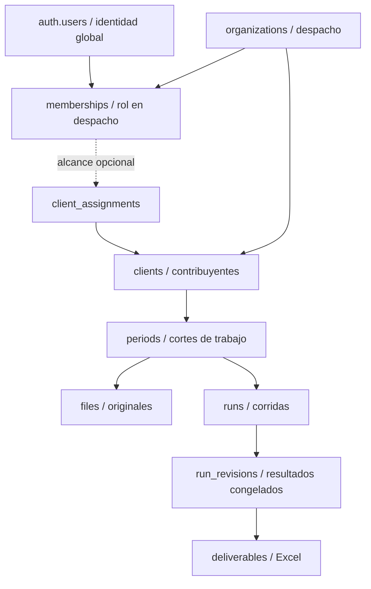
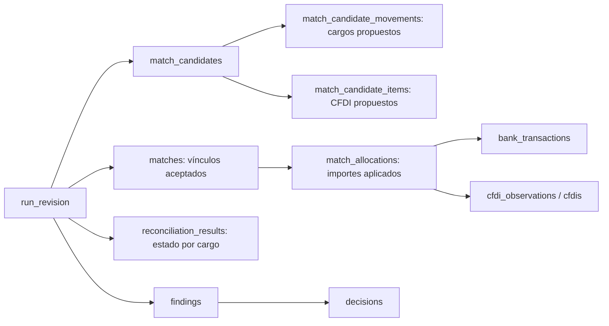

# ProConta — Modelo conceptual de datos V1

**Estado:** diseño, no SQL ni migración. **Alcance inicial:** salidas de cuentas bancarias contra CFDI recibidos. Este modelo aterriza el [contrato verificable del Servicio 1](servicio-1-contrato-tecnico.md) dentro de la [arquitectura V1](arquitectura-v1.md). Los nombres son propuestos, no nombres definitivos de tablas. Un campo `*_id` representa una clave conceptual estable; los tipos físicos, índices y políticas se decidirán antes de implementar.

## 1. Convenciones e invariantes

- `organization_id` identifica al despacho propietario y acompaña **cada registro sensible de negocio**, incluso los hijos de una corrida; la identidad global de Auth y su perfil son la excepción. `client_id` identifica al contribuyente dentro de ese despacho cuando aplica. Ni un ID recibido de React ni una ruta de Storage conceden acceso: sesión, membresía, rol, alcance de cliente y pertenencia de cada relación se verifican en servidor; RLS será una segunda barrera.
- Identidades y periodos no equivalen a nombres. `auth_user_id`, `organization_id`, `client_id`, `period_id`, `file_id`, `run_id` y `run_revision_id` son referencias estables. El UUID fiscal de un CFDI es **identidad de documento**, no localizador de archivo ni clave de autorización.
- Importes de MXN usan valor decimal exacto a centavos; se conserva la moneda. Fechas de emisión, operación y corte se guardan separadas de la hora y zona horaria cuando existan. `NULL` significa desconocido, no cero ni “sin diferencia”.
- Original, renglón/página, valores crudos, dato normalizado, regla y versión, candidato, asignación, hallazgo, decisión y entregable forman una cadena recorrible. Toda transformación conserva la entrada relevante y la versión de parser que la produjo.
- Una corrida fija **qué archivos/cortes y versiones** usó. Las decisiones posteriores crean una nueva revisión de resultado; no cambian un Excel ya emitido. Las proyecciones consultables pueden cambiar, pero eventos y revisiones publicadas no se reescriben.
- `match_status` (`matched`, `partial`, `unmatched`, `probable`, `not_required`), `review_status` (`clear`, `has_findings`, `requires_decision`, `resolved`), `run_status` (`preclose`, `final_with_pending`, `final`, `blocked`) y estado técnico de `job` son ejes distintos.

## 2. Propiedad y acceso

`auth.users` pertenece a Supabase Auth; ProConta no guarda contraseñas ni duplica esa identidad. `profiles` y `memberships` son entidades distintas: una persona puede pertenecer a más de un despacho con roles diferentes. Todos los datos de negocio de un cliente pertenecen al `organization_id` de su despacho. Si se limita acceso por cliente, `client_assignments` refina la membresía sin sustituirla.

| Entidad y clave conceptual | Propósito, campos importantes y relaciones | Alcance e historia |
| --- | --- | --- |
| `organizations` (`organization_id`) | Despacho SaaS; nombre visible, estado, configuración no contable. Padre de clientes y membresías. | Global como identidad de tenant; cambios de nombre/estado auditados, ID no se recicla. |
| `auth.users` (`auth_user_id`) y `profiles` (`auth_user_id`) | Identidad Auth y perfil de presentación: nombre, correo de referencia, estado. El correo verificado se obtiene de Auth al autorizar invitaciones; el perfil no es fuente de permisos. | Identidad global; datos de presentación editables y auditados. |
| `invitations` (`invitation_id`) | Invitación a un `organization_id` para correo normalizado, rol propuesto, emisor, caducidad, uso/revocación y referencia opaca al token; aceptación vincula `auth_user_id`. | Tenant; conservar historial de envío/aceptación/revocación. No guardar token en claro. |
| `memberships` (`membership_id`) | `organization_id`, `auth_user_id`, rol, estado, quién invitó, alta/baja. Una identidad puede tener varias membresías, pero no dos activas equivalentes en el mismo despacho. | Tenant; rol/estado actuales consultables, cambios auditados. No autorizar por metadatos editables del usuario. |
| `clients` (`client_id`) | Contribuyente de un despacho: RFC, razón social, alias, estado, política aplicable. `organization_id` obligatorio. | Tenant; RFC/nombre corregibles solo con auditoría, sin mover silenciosamente archivos históricos. |
| `client_assignments` (`assignment_id`, opcional) | Miembro–cliente y permiso específico si el despacho adopta cartera restringida. | Tenant; vigencia e historial. Su necesidad es decisión pendiente antes de SQL. |
| `periods` (`period_id`) | Cliente, mes/rango fiscal-calendario, fechas y estado de trabajo. Los **cortes por cuenta pertenecen a la corrida**, no al mes abstracto. El periodo de un CFDI puede diferir del periodo bancario de la corrida. | Tenant y cliente; cambios de estado auditados, sin alterar entradas históricas. |

## 3. Evidencia de archivos y normalización

| Entidad y clave conceptual | Propósito, campos importantes y relaciones | Alcance e historia |
| --- | --- | --- |
| `files` (`file_id`) | **Una subida original, nunca un nombre lógico reutilizable.** `organization_id`, `client_id`, `period_id`, tipo/origen/perfil detectado, bucket/ruta opaca, `sha256`, nombre original, tamaño, MIME declarado y detectado, `uploaded_by`, `uploaded_at`, corte declarado, `supersedes_file_id` opcional y estado de aceptación. Un nuevo upload, aun idéntico, tiene nuevo `file_id`; el hash advierte duplicados. | Tenant/cliente; metadatos de origen y objeto inmutables. El estado de procesamiento es una proyección auditada; objeto original privado no se sobrescribe. |
| `file_validations` (`file_validation_id`) | Intento de identificar, leer y validar un `file_id`: perfil/parser y versión, estructura, titular/RFC, periodo, corte, totales fuente y leídos, códigos/motivos de rechazo, localizadores, instante. Una validación aceptada autoriza uso en corrida; un archivo rechazado no entra al matching. | Tenant/cliente; cada intento y resultado son históricos, no se corrige un fallo borrándolo. |
| `source_extractions` (`extraction_id`) | Lote concreto de normalización de un `file_id` y una validación aceptada: perfil/versión de parser, job, instante, conteos/hash de filas extraídas y resultado. Permite volver a procesar un original con parser nuevo **sin mezclar ambas extracciones**. | Tenant/cliente; lote publicado inmutable. Una corrida selecciona una extracción exacta por archivo. |
| `bank_accounts` (`bank_account_id`) | Cuenta **de origen**: banco, moneda, identificador de cuenta/CLABE protegido, titular, RFC titular, cliente propietario, vigencia. No confundir con destino del pago. | Tenant/cliente; cambios relevantes versionados o con vigencia, para no reinterpretar movimientos previos. |
| `bank_transactions` (`bank_transaction_id`) | **Movimiento normalizado** de una cuenta: `bank_account_id`, `source_file_id`, `extraction_id`, `source_sheet`+`source_row` o `source_page`+`source_locator`, secuencia/ID bancario si existe, fecha/hora original y normalizada, fecha de operación, cargo/abono, importe, moneda, descripción original y normalizada, RFC/CLABE extraídos con su evidencia, saldo si existe. Incluye abonos necesarios para Control aunque el matching inicial se concentre en salidas. | Tenant/cliente por cuenta y extracción; fila y valores normalizados son históricos. Una corrección de parser produce otra extracción/corrida, no edición silenciosa. Debe distinguir mismo cargo legítimo de duplicación del mismo renglón. |
| `vendors` (`vendor_id`) | Proveedor del cliente: RFC fiscal normalizado, nombre y alias de origen, vigencia; referencias a CFDI y catálogos de destino. El RFC gobierna identidad cuando está disponible, no el parecido de nombre. | Tenant/cliente; alias/correcciones auditados. Un proveedor homónimo de otro despacho no se fusiona. |
| `vendor_bank_accounts` (`vendor_bank_account_id`) | Asociación **cuenta destino/CLABE → proveedor/RFC**, banco, evidencia de alta, fuente, vigencia y estado de confirmación. Permite candidata de transferencia, pero una coincidencia de CLABE sin vigencia/confirmación no es certeza automática. | Tenant/cliente; asociaciones históricas versionadas y decisiones conservadas. No guarda secretos de acceso bancario. |
| `cfdis` (`cfdi_id`) | **Identidad fiscal canónica** del documento: UUID si existe, cliente receptor, emisor/proveedor identificado y estado de identidad. Un UUID válido identifica un solo CFDI por cliente dentro del conjunto aceptado; las múltiples apariciones no multiplican su total. Sin UUID válido, permanece como observación no confirmada hasta contar con evidencia y decisión explícita; no se identifica automáticamente por semejanza. | Tenant/cliente; identidad estable. Los valores y estatus observados viven en versiones históricas, no se sobrescriben aquí. |
| `cfdi_observations` (`cfdi_observation_id`) | **Versión observada del CFDI** en una extracción: `cfdi_id` si está identificado, UUID crudo, RFC emisor/receptor, tipo, fecha/hora de emisión, moneda, total, método/forma de pago, estatus/cancelación, periodo de emisión, fuente y estado de aceptación/conflicto. La corrida fija cuál observación validada sustenta un match. | Tenant/cliente; inmutable. Un nuevo reporte o corrección del parser agrega observación; valores contradictorios se conservan y no se elige uno silenciosamente. |
| `cfdi_source_rows` (`cfdi_source_row_id`) | Aparición/procedencia de `cfdi_observation_id` en `source_file_id` y `extraction_id`: hoja+renglón o página+localizador, valores crudos relevantes, grupo de filas del mismo UUID y resultado de validación. Una fila duplicada o varias filas de un reporte no crean otro CFDI ni otro importe. | Tenant/cliente; renglones históricos inmutables. En conflicto, conservar ambas evidencias y excluir la observación discutida del match. |
| `cfdi_relations` (`cfdi_relation_id`) | Relación documentada entre CFDI: tipo de relación disponible (p. ej. anticipo, saldo o REP), origen/destino, UUID referenciado, evidencia fuente y estado de verificación. Una relación sugerida y una verificada son distintas. | Tenant/cliente; conservar evidencia y revisión humana; no inferir efecto fiscal nuevo por mera relación. |

**Límite de deduplicación:** el mismo nombre de archivo, hash de archivo, fila repetida y UUID repetido son fenómenos distintos. `files` conserva cada subida; `cfdi_source_rows` conserva cada aparición; `cfdi_observations` conserva cada versión; `cfdis` cuenta una sola identidad fiscal aceptada por cliente/UUID. Si el reporte carece de UUID válido o contiene UUID con datos contradictorios, no se “fusiona” por importe: queda como observación no aceptada con validación/hallazgo. El control del archivo cuenta renglones y el control de CFDI cuenta documentos únicos; ambos deben poder explicarse.

## 4. Corridas, ejecución y versiones

| Entidad y clave conceptual | Propósito, campos importantes y relaciones | Alcance e historia |
| --- | --- | --- |
| `runs` (`run_id`) | Unidad de conciliación de un cliente/periodo y alcance declarado: cuentas, cortes, moneda, tipo precierre/cierre, corrida de precierre vinculada, `parser_manifest`, `engine_version`, `rule_set_version`, iniciador, fechas y `run_status`. Fija una foto de entradas; no toma automáticamente archivos subidos después. | Tenant/cliente; definición de entrada inmutable al iniciar. `run_status` actual es proyección de revisiones/controles; transiciones auditadas. |
| `run_files` (`run_file_id` o pareja `run_id`+`file_id`) | Archivos exactos incluidos, rol (`bank_source`, `cfdi_source` u otro futuro), `file_validation_id` y `extraction_id` aceptados, hash al fijar corrida, corte y cuenta asociada cuando aplique. No puede vincular archivo de otro cliente/despacho. | Tenant/cliente; conjunto inmutable por corrida. Sustituir un archivo o extracción exige otra corrida; una revisión de resultado no modifica entradas. |
| `run_revisions` (`run_revision_id`) | Foto de **resultados y decisiones aplicadas**: número secuencial por corrida, instante, actor/motivo, IDs de decisiones vigentes, manifiesto de reglas/versiones, Control y estado de liberación. El Excel apunta a esta revisión, no simplemente al `run_id`. | Tenant/cliente; publicadas inmutables. Nueva decisión o recálculo crea nueva revisión, sin alterar una anterior. |
| `jobs` (`job_id`) | Ejecución técnica de validación, normalización, matching, control o generación: `run_id` o `file_id`, tipo, etapa, progreso, estado `pending`/`processing`/`waiting_review`/`completed`/`failed`, `created_at`, `started_at`, `finished_at`, error resumido, intentos, `idempotency_key`, versión de ejecutor y correlación. | Tenant/cliente; estado/progreso operativos mutables, cada intento y error se preservan en eventos/logs. `failed` no equivale a `run_status = blocked`. |
| `rules` (`rule_id`) y `rule_versions` (`rule_version_id`) | Catálogo de identidad y versión inmutable de reglas de matching, validación fiscal o Control: código, clase, parámetros base, vigencia, justificación y versión del motor compatible. Una corrida fija el conjunto exacto. | Reglas base pueden ser globales; versiones publicadas no se editan. Cambiar tolerancia/ventana exige nueva versión y corrida/revisión. |
| `client_criteria` (`criterion_id`) | Criterio particular autorizado para un cliente: regla relacionada, parámetro/alcance, vigencia, evidencia, autor y estado. No es una decisión tácita para todos los clientes ni una regla fiscal inventada. | Tenant/cliente; cada cambio crea versión/historia auditada. Se aplica solo si la corrida lo incluyó explícitamente. |

**Versiones reproducibles:** `run_files` fija la extracción por archivo y `parser_manifest` registra perfil y versión **por archivo**, no solo una cadena global; `engine_version`, `rule_set_version` y versión de criterios quedan congeladas. Cada corrida también fija las observaciones de CFDI aceptadas derivadas de esas extracciones. La configuración de ventanas/tolerancias usada en cada candidato debe ser visible. Idempotencia de jobs significa que reintentar una etapa con las mismas entradas no duplica movimientos, candidatos, hallazgos o Excel; no significa volver a usar una decisión humana de otra revisión sin registrarla.

## 5. Matching, asignaciones y resultados

| Entidad y clave conceptual | Propósito, campos importantes y relaciones | Alcance e historia |
| --- | --- | --- |
| `match_candidates` (`candidate_id`) | **Hipótesis, no asignación contable.** `run_id`/revisión de cálculo, grupo candidato, tipo (directo, composición, anticipo, extraordinario), regla/versiones, señales y evidencia a favor/en contra, diferencia, distancia de fecha, nivel de confianza cualitativo, si requiere decisión y motivo. Conserva alternativas relevantes y descartes explicables. | Tenant/cliente; salida calculada histórica por versión/revisión. Generar candidato no consume saldo de movimiento/CFDI. |
| `match_candidate_movements` (`candidate_movement_id`) | Cargos propuestos de la hipótesis: `candidate_id`, `bank_transaction_id`, importe propuesto y papel en composición. Permite varios pagos para un CFDI y evita listas opacas. | Tenant/cliente; histórico con el candidato, sin consumir el cargo. |
| `match_candidate_items` (`candidate_item_id`) | Miembros propuestos de la hipótesis: `candidate_id`, `cfdi_id`, `cfdi_observation_id`, importe propuesto, papel en composición, evidencia de origen. Permite varios CFDI para un pago sin meter una lista opaca en un campo. | Tenant/cliente; históricos con el candidato. No son asignaciones confirmadas. |
| `matches` (`match_id`) | Encabezado de un **vínculo aceptado** por regla determinística permitida o decisión explícita: `run_revision_id`, tipo (uno-a-uno, uno-a-varios, varios-a-uno, anticipo/liquidación), `candidate_id` origen opcional, `rule_version_id`, `decision_id` cuando proceda, fecha y justificación. No guarda un total inventado ni da por válida la fiscalidad del CFDI. | Tenant/cliente; inmutable dentro de revisión publicada. Rechazar/cambiar una decisión crea otra revisión con otro conjunto de matches. |
| `match_allocations` (`allocation_id`) | Cada aplicación concreta `match_id`–`bank_transaction_id`–`cfdi_id`–`cfdi_observation_id`, con `bank_amount_applied`, `cfdi_amount_applied`, moneda, diferencia explícita, tipo de aplicación y vínculo de anticipo si aplica. Una relación uno-a-varios o varios-a-uno se expresa con varias filas, y las sumas se verifican **por ambos lados**. | Tenant/cliente; inmutables en revisión. Nunca aplicar más saldo que el movimiento o CFDI disponible; una diferencia tolerada permanece visible y no cambia importes fuente. |
| `reconciliation_results` (`result_id`) | **Exactamente un resultado por salida aceptada y revisión**: `bank_transaction_id`, `run_revision_id`, `match_status`, `review_status`, importes aplicado/pendiente y referencias a matches/findings. Es una proyección calculada, no el dato fuente. Incluye explícitamente `unmatched`, `probable` y `not_required` para que ningún cargo desaparezca. | Tenant/cliente; cada revisión conserva su resultado; el “actual” se obtiene por la revisión vigente, no editando una versión publicada. |

`matches` representa la decisión de asociación; `match_allocations` representa **cuánto** de cada movimiento cubre **cuánto** de cada CFDI. Un anticipo puede tener su CFDI y posterior liquidación sin consumir dos veces el mismo importe. Un pago de tarjeta bancaria puede tener `not_required` en esta conciliación, pero **no** un match ficticio con un CFDI; compras de tarjeta usarán el mismo patrón de fuente/movimiento/asignación en una ampliación, con tipo de cuenta/instrumento y control de doble conteo explícitos.

**Invariantes del resultado:** una salida no puede estar en dos resultados de la misma revisión; un CFDI no puede asignar más de su saldo disponible en esa revisión; cada lado de una asignación cuadra, incluyendo diferencias visibles; si un candidato es `probable`, no existe asignación definitiva hasta decisión; matching y validación fiscal generan artefactos diferentes. Una decisión puede aceptar una relación y mantener un finding fiscal abierto.

## 6. Hallazgos, decisiones, Control y entregables

| Entidad y clave conceptual | Propósito, campos importantes y relaciones | Alcance e historia |
| --- | --- | --- |
| `findings` (`finding_id`) | Observación de matching, validación fiscal, archivo o Control: `run_revision_id`, movimiento/CFDI implicados (opcionales según tipo), regla/version, localizadores y evidencia, importe/diferencia, explicación, confianza cualitativa, gravedad, pregunta/acción requerida y estado de atención. PPD sin REP o forma distinta **no borran** un match. | Tenant/cliente; hecho detectado y evidencia inmutables por revisión. Estado de atención se deriva de decisiones/eventos; un finding pendiente sigue visible en `final_with_pending`. |
| `decisions` (`decision_id`) | Acto humano explícito: actor/membresía, instante, objeto/candidato/finding afectado, tipo (`confirm`, `reject`, `mark_not_required`, `leave_pending`, etc.), alcance cliente/periodo/corrida, motivo, evidencia, decisión anterior que sustituye y revisión resultante. No altera fuente ni crea criterio global automáticamente. | Tenant/cliente; append-only. Corregir una decisión agrega otra con `supersedes_decision_id`; la anterior permanece consultable. Requiere rol y autorización. |
| `controls` (`control_id`) | Comprobación individual de una `run_revision_id`: código/version, ámbito (archivo, cuenta, corrida), total fuente, total leído, conteo/importe esperado y obtenido, delta exacta, evidencia/IDs y resultado. Control ≠ 0 o archivo crítico no verificable bloquea Excel final. | Tenant/cliente; inmutable por revisión; no hay un único neto que pueda compensar dos errores opuestos. |
| `deliverables` (`deliverable_id`) | Excel producido desde **una** `run_revision_id`: bucket/ruta privada, hash, tamaño, versión de plantilla/generador, fecha, actor/job, `run_status` de emisión y estado de liberación. Referencias de celda/fórmula a resultado/control permiten auditar cifras. | Tenant/cliente; archivo emitido inmutable. Una nueva revisión genera nuevo entregable. Descargas se autorizan y auditan. |
| `audit_events` (`audit_event_id`) | **Quién hizo qué y cuándo:** `organization_id`, `actor_auth_user_id`/actor sistema, membresía, tipo de evento, entidad/ID, instante, `request_id`/`job_id`/`run_id`, referencias antes/después y metadatos mínimos. Ejemplos: `file.uploaded`, `run.started`, `finding.created`, `decision.confirmed`, `decision.changed`, `deliverable.generated`, `deliverable.downloaded`. | Tenant; append-only y protegido de edición ordinaria. No guardar contenido de CFDI, credenciales, tokens ni URLs firmadas. |

Un hallazgo puede ser un pendiente documental legítimo o un error de integridad; solo el segundo bloquea la liberación. `final_with_pending` requiere archivos críticos verificables, cobertura total de cargos, todos los controles de integridad en cero y pendientes **enumerados** en el Excel. `final` requiere además ausencia de pendientes abiertos. `blocked` no libera entregable final. La decisión `leave_pending` documenta una respuesta humana, pero no transmuta por sí sola `unmatched` en `matched` ni oculta la obligación documental.

## 7. Recorridos de trazabilidad y reglas de conservación

Para responder “¿de dónde salió $8,622.15?”, el recorrido es: `deliverables` (revisión, celda/fórmula) → `controls`/`reconciliation_results` → `matches` y `match_allocations` **o** candidato pendiente → `bank_transactions` (valor normalizado y original, extracción, archivo/hoja/renglón) → `files` (hash y objeto original). Para el CFDI de $8,622.01: asignación/candidato → `cfdi_observations` → `cfdis` y `cfdi_source_rows` (filas originales y archivo). Regla/versiones, diferencia de $0.14, finding y `decisions` explican por qué quedó `probable` o quién confirmó después. `audit_events` muestra acciones de usuario; logs técnicos muestran errores de ejecución, sin sustituir la cadena contable.

| Clase | Puede cambiar | Nunca se reescribe silenciosamente |
| --- | --- | --- |
| Perfil, membresía, asignación de cliente, alias de proveedor | Estado/atributos actuales, con autorización y auditoría. | Historial de rol, revocación, criterios y decisiones usadas por una corrida. |
| Archivo y dato fuente | Estado de validación como proyección; nueva subida o extracción crea nuevo registro/versión. | Objeto original, hash, localizador, valores crudos y resultado de validación ya emitido. |
| Corrida y job | Estado/progreso actuales y revisión vigente; reintentos de job. | Conjunto de archivos fijado, manifiesto de versiones, eventos de intentos y revisiones publicadas. |
| Cruces, hallazgos y decisiones | Nueva revisión puede generar otros resultados; finding puede resolverse mediante decisión. | Candidato, asignación, evidencia, hallazgo y decisión de una revisión publicada. |
| Excel y auditoría | Estado de acceso/liberación auditable; política de retención futura. | Bytes/hash del Excel emitido y eventos de auditoría. |

## 8. Integridad multiempresa y decisiones antes de SQL

**Restricciones conceptuales a convertir después en claves, unicidad, índices, autorizaciones y RLS:**

1. Toda relación de negocio conserva `organization_id` y, donde aplica, `client_id` coincidentes: archivo–extracción–movimiento–cuenta, archivo–extracción–observación CFDI–fila, corrida–archivo, match–movimiento–CFDI y entregable–revisión. Un ID de otro despacho nunca se acepta por existir.
2. Un UUID fiscal aceptado se cuenta una sola vez por cliente; sus múltiples filas/orígenes quedan enlazados. El mismo renglón fuente no genera dos movimientos en la misma versión de extracción. Las claves de deduplicación no deben colapsar dos cargos legítimos iguales.
3. Una corrida toma archivos validados y un manifiesto de versiones fijo. Cada salida del alcance tiene un resultado por revisión. Sumas de asignaciones y saldos se verifican en ambos lados; cada control se evalúa separado.
4. Una revisión publicada, una decisión, un evento y un entregable emitido son históricos. Acciones posteriores referencian/sustituyen, no borran. Retención y borrado legal requieren política específica que preserve la capacidad de auditoría permitida.
5. Índices de pertenencia y búsqueda deberán cubrir tenant+cliente+periodo, archivo+localizador, UUID fiscal, corrida+revisión, estado de job/idempotencia y trazabilidad. El diseño físico se hará con cargas y permisos reales; este documento **no** propone DDL.

**Preguntas de diseño pendientes antes de SQL:** matriz rol–acción y acceso a clientes; si se habilitan asignaciones por cliente desde el primer día; fuente autoritativa y resolución de datos fiscales contradictorios entre observaciones; política de caducidad, revocación y correo de invitaciones; retención de originales, entregables y eventos; límites de archivo/reintentos; criterio formal de corte y alternativa para fuentes sin totales impresos; semántica exacta de liberación de revisiones; protección de CLABE y datos personales. Estas preguntas no autorizan inferir nuevas reglas fiscales ni implementar infraestructura ahora.
